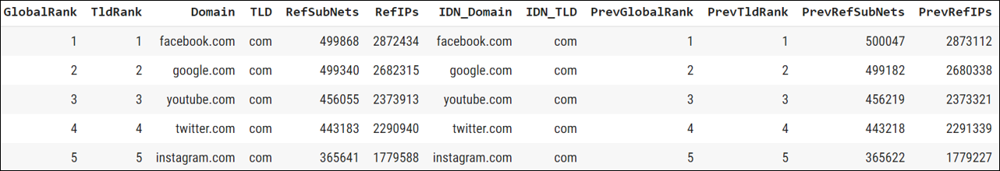
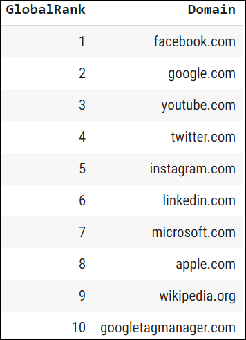
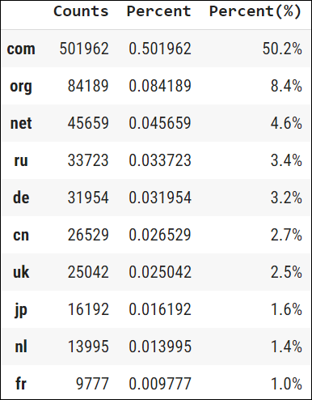
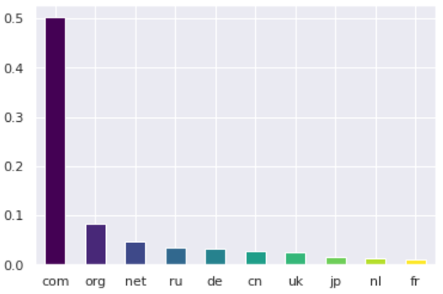
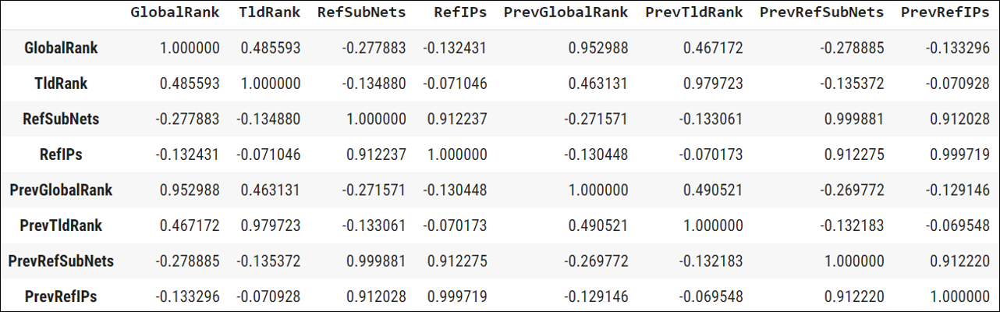
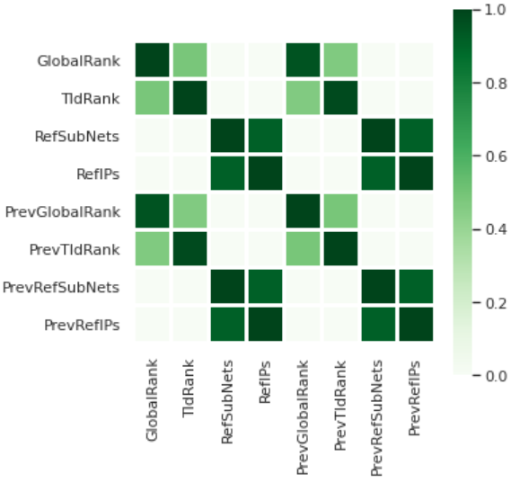

# Million Domains Crawled and Counting

*By: Kyle W. Brown*

## Overview

This analysis reviews the top domains that are global ranked through Majestic Million, a database of a million domains that find the most referring subnets. Free search and download of the top million websites, from the world's largest commercially available backlink database. The [majestic_million.csv](https://downloads.majestic.com/majestic_million.csv) dataset is from [Majestic](https://majestic.com/)

<br>

## Table of Contents

* [About Majestic](#about-majestic)
* [Data](#data)
* [Top Ten Global Ranked SEO's](#top-ten-global-ranked-seos)
* [Top-Level Domains Breakdown](#top-level-domains-breakdown-for-majestic)
* [Top 10 TLDs Visualization](#top-10-tlds-visualization)
* [Correlation Analysis](#correlation-analysis)
* [Correlation Heatmap](#correlation-heatmap)

<br>

## About Majestic

Majestic offers leading-edge support for SEOs, Developers, Digital Entrepreneurs, Analysts, Businesses, Online marketing professionals and Affiliate Managers. The largest commercial link intelligence database in the world, Majestic crawls the web and views around a billion URLs a day. They analyze the data via their Flow Metrics algorithm and share the results so that you can illuminate your business presence on the web, and improve your Search Engine Ranking.

## Data

The data can be found here:

https://downloads.majestic.com/majestic_million.csv

### Load Data

```python
import pandas as pd

# Loading data fom Raw Git csv
domains = pd.read_csv('https://raw.githubusercontent.com/tianhuil/design-data/main/data/majestic_million.csv?token=AMCCLAEHZDKK4DUKMRI2Y6TAWGY4K')
```


<br>

# Top Ten Global Ranked SEOs

A top-level domain is one of the domains at the highest level in the hierarchical Domain Name System of the Internet. The top-level domain names are installed in the root zone of the name space. For all domains in lower levels, it is the last part of the domain name, that is, the last label of a fully qualified domain name. (Wikipedia)

```python
# Create the top_10_domains pandas series
top_10_domains = domains.loc[:, ["GlobalRank", "Domain"]].head(10)
top_10_domains
```



<br>

# Top Level Domains Breakdown for Majestic 

Top-level domain (TLD) breakdown for majestic dataset. 

```python
s = domains.TLD
counts = s.value_counts()
percent = s.value_counts(normalize=True)
percent100 = s.value_counts(normalize=True).mul(100).round(1).astype(str) + '%'
pd.DataFrame({'Counts': counts, 'Percent': percent, 'Percent(%)': percent100}).head(10)
```



## Top 10 TLDs Visualization

```python
from matplotlib import cm
import matplotlib.pyplot as plt
from matplotlib.ticker import PercentFormatter

viridis = cm.get_cmap('viridis', 10)

percent = percent.head(10)
percent.plot(kind='bar', color=viridis.colors, rot=0);
```



<br>

# Correlation Analysis

```python
domains.corr()
```


As expected GlobalRank and TldRank are closely correlated (49%), surprising RefSubNets and RefIPs account for a 91% correlation. Besides the stated correlations the dataset provides interesting correlations among all fields.

<br>

# Correlation Heatmap


